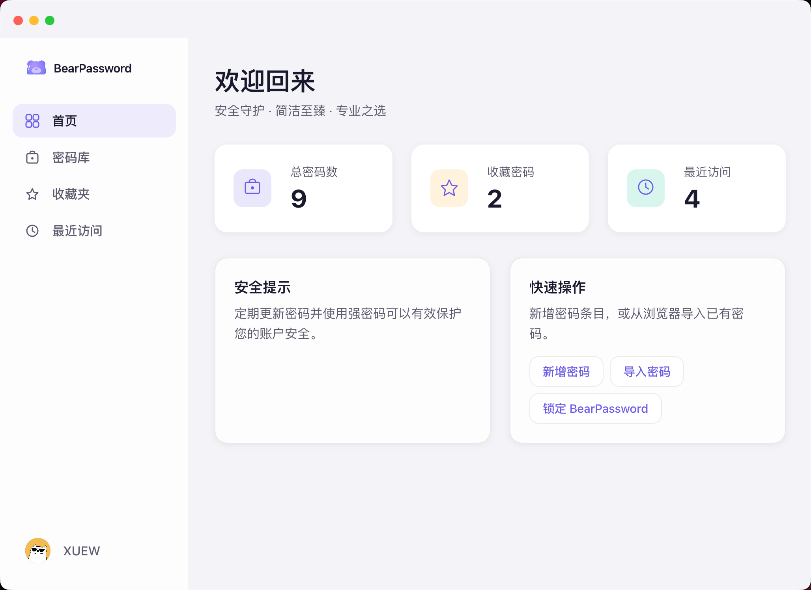
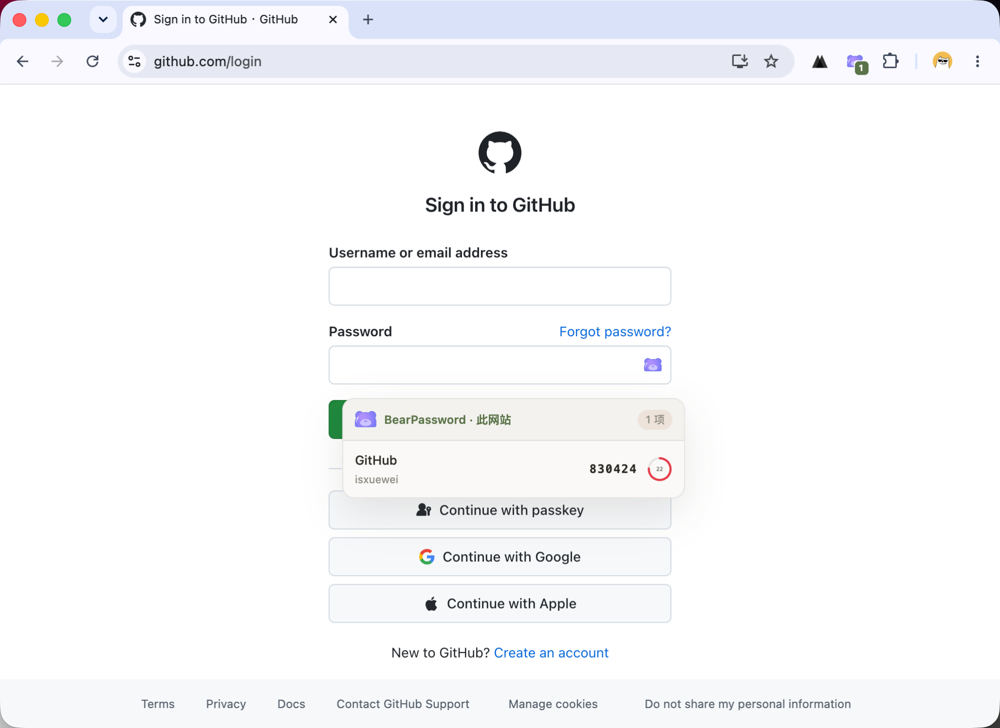
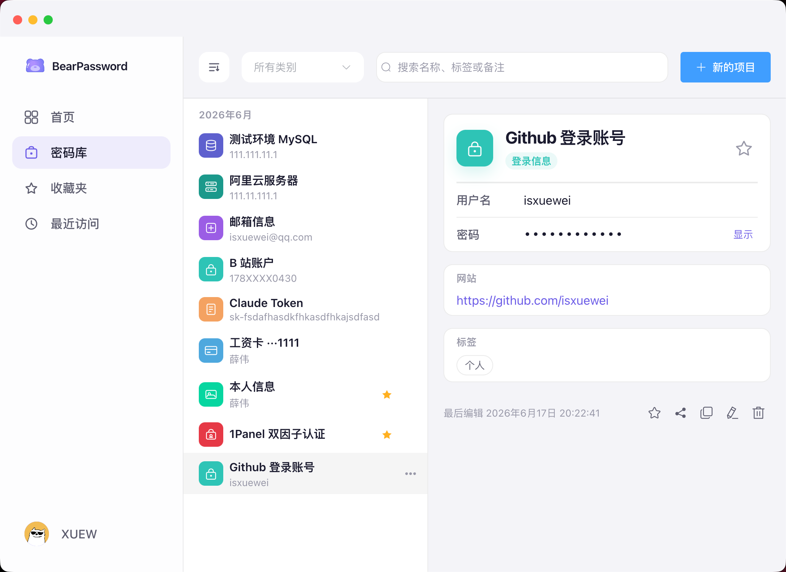
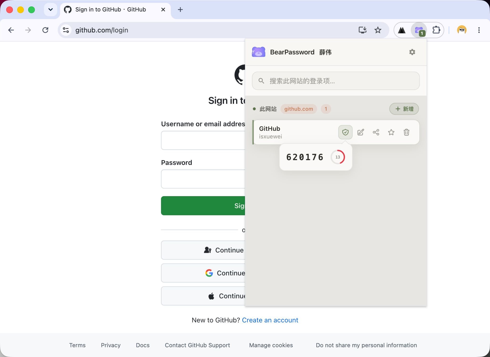

<p align="center">
  
</p>

<h1 align="center">BearPassword</h1>

<p align="center">
  简洁、安全、专业的密码管理工具<br />
  桌面端 + 浏览器扩展，帮你安心保存账号、密码与二次验证码
</p>

<p align="center">
  <a href="https://bear-password.xuewei.fun">官网下载</a>
</p>

---

## BearPassword 能做什么？

BearPassword 是一套完整的密码管理方案，由**桌面应用**和**浏览器扩展**配合使用：

- 在桌面端集中管理各类敏感信息（登录账号、银行卡、证件、服务器、数据库、安全备注等）
- 在网页登录时一键填充用户名和密码
- 支持在条目或扩展中查看、复制**两步验证码（TOTP）**
- 数据在本地加密后再同步，主密码不会明文上传到服务器

<p align="center">
  
</p>

<p align="center">
  
</p>

---

## 推荐使用方式

1. 从 [官网](https://bear-password.xuewei.fun) 下载并安装 **BearPassword 桌面端**（支持 macOS、Windows）
2. 注册账号，设置主密码，解锁保险库（建议同时配置安全密钥）
3. 安装 **浏览器扩展**（Chrome / Edge）
4. 日常使用：保持桌面端在后台运行并已解锁，即可在网页中自动填充

> 扩展通过本机与桌面端安全通信获取数据，不会单独保存你的主密码。桌面端未运行时，加密条目无法在网页中填充。

---

## 主要功能

### 桌面端

| 能力 | 说明 |
|------|------|
| 多种条目类型 | 登录信息、安全备注、身份、银行卡、服务器、数据库、两步验证、自定义 |
| 登录扩展字段 | 可为同一条目添加 URL、邮箱、地址、电话、备用密码、**两步验证**等 |
| 两步验证 | 支持密钥、二维码识别，详情页实时显示验证码 |
| 安全与隐私 | 客户端加密、自动锁定、剪贴板定时清空、可选生物识别解锁 |
| 使用体验 | 收藏夹、最近访问、标签、搜索、多主题、中/英/日界面 |

<p align="center">
  
</p>

### 浏览器扩展

| 能力 | 说明 |
|------|------|
| 智能匹配 | 根据当前网站自动列出可用登录项 |
| 一键填充 | 点击密码框旁图标，或打开扩展弹窗选择条目 |
| 二次验证 | 弹窗与网页填充层可显示实时验证码；填充时自动复制 TOTP |
| 快捷保存 | 检测到新登录信息时可提示保存到保险库 |

<p align="center">
  
</p>

---

## 项目组成

本仓库包含 BearPassword 的完整产品代码：

| 目录 | 面向谁 | 说明 |
|------|--------|------|
| [bear-password-desktop](bear-password-desktop/) | 所有用户 | 桌面客户端 |
| [bear-password-extension](bear-password-extension/) | 所有用户 | 浏览器扩展 |
| [bear-password-server](bear-password-server/) | 自建部署 | 账号与数据同步服务 |
| [bear-password-index](bear-password-index/) | — | 官网静态页面 |

各子项目说明见对应 README。

---

## 给开发者的简要说明

若你需要从源码运行或参与开发：

**环境：** Node.js 18+、Java 17、MySQL 8（仅自建服务端时需要）

```bash
# 服务端（可选，本地自建）
cd bear-password-server && mvn spring-boot:run

# 桌面端
cd bear-password-desktop && npm install && npm run dev

# 浏览器扩展
cd bear-password-extension && npm install && npm run dev
```

本地 API 默认地址：`http://127.0.0.1:8080`  
扩展开发时在 `chrome://extensions` 加载 `bear-password-extension/dist` 目录。

更详细的构建与打包说明，请查看各子目录 README。

一键打包（Mac / Windows / 浏览器扩展）产物统一输出到仓库根目录 `release/`。

---

## 安全说明（用户可读版）

- 你的保险库内容在设备上加密后才会上传或同步
- 网页填充时，扩展只向本机桌面端请求已解锁的条目
- 两步验证码在本地根据密钥实时计算，不会把密钥发给网站

---

## 许可证

MIT · 作者：薛伟同学
