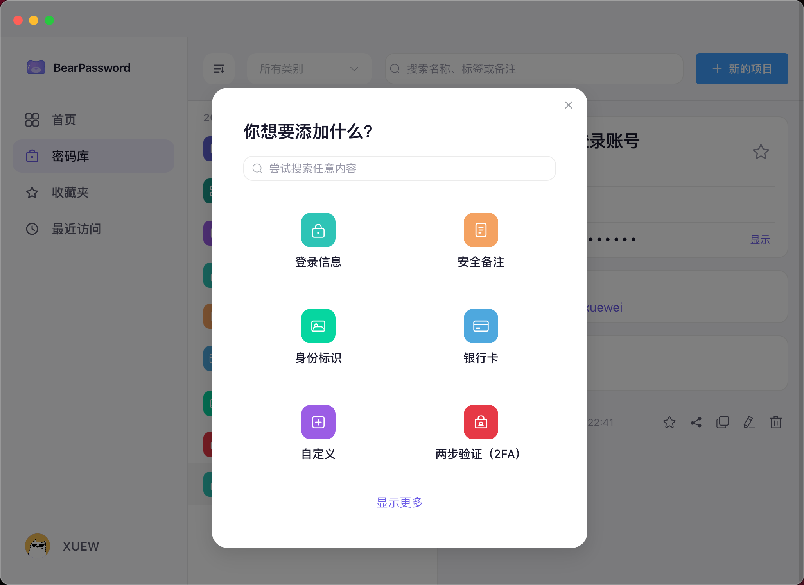
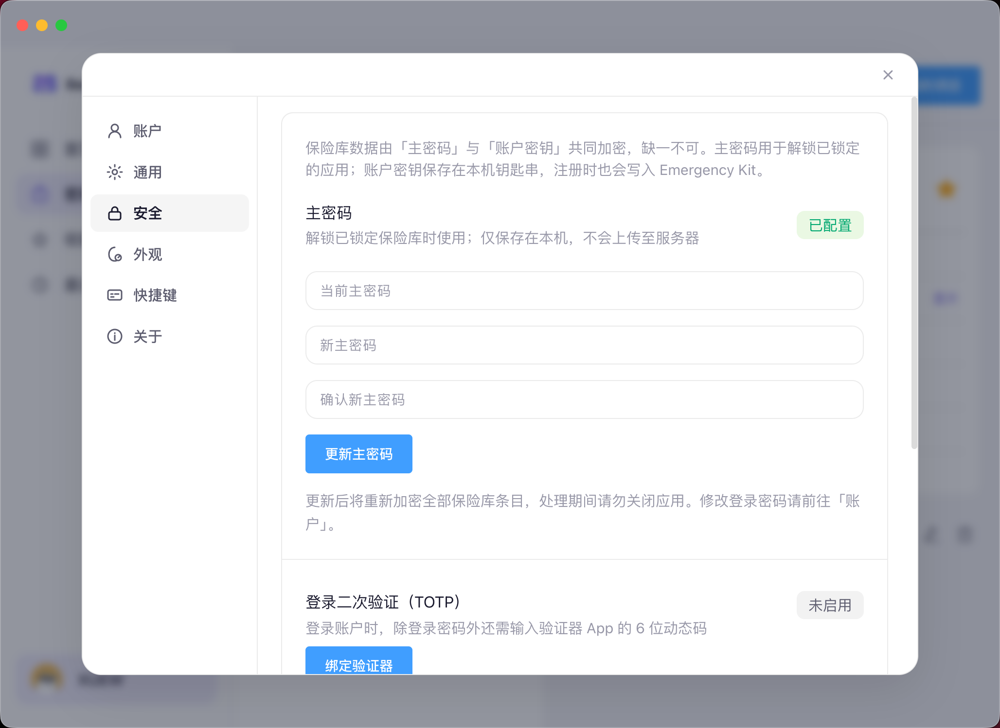

<p align="center">
  
</p>

<h1 align="center">BearPassword 桌面端</h1>

<p align="center">在电脑上管理密码库、生成强密码、查看两步验证码的主应用</p>

<p align="center">
  <a href="https://bear-password.xuewei.fun">官网下载</a> ·
  <a href="../README.md">返回项目首页</a>
</p>

---

## 你可以用它做什么

- **保存各类敏感信息**：网站登录、银行卡、身份证信息、服务器与数据库连接、安全备注、独立的两步验证条目等
- **登录条目更丰富**：通过「添加更多」补充 URL、邮箱、地址、电话、备用密码、**两步验证**等字段
- **查看 TOTP 验证码**：在条目详情中实时显示 6 位验证码与倒计时；支持扫码或粘贴密钥导入
- **保护隐私**：主密码 + 可选安全密钥；离开一段时间自动锁定；复制敏感内容后可定时清空剪贴板
- **配合浏览器扩展**：桌面端解锁后，扩展才能在网页中自动填充

<p align="center">
  
</p>

<p align="center">
  
</p>

---

## 下载与安装

请前往 [BearPassword 官网](https://bear-password.xuewei.fun) 下载对应系统安装包：

- **macOS**：`.dmg` 安装包（内含应用与安装说明）
- **Windows**：安装程序或便携版压缩包

安装后注册账号，按引导完成保险库初始化即可使用。

---

## 与浏览器扩展配合

1. 安装 [浏览器扩展](../bear-password-extension/)
2. 保持 BearPassword 桌面端**已登录且保险库已解锁**
3. 打开需要登录的网站，点击输入框旁的 BearPassword 图标进行填充

扩展通过本机安全通道读取数据，无需在浏览器里再次输入主密码。

---

## 从源码运行（开发者）

**要求：** Node.js ≥ 18，npm ≥ 9

```bash
npm install
npm run dev          # 开发模式，自动打开窗口
npm run build        # 构建
npm run build:mac    # 打包 macOS 安装包
npm run build:win    # 打包 Windows 安装包
npm run typecheck    # 类型检查
```

开发环境默认连接 `http://127.0.0.1:8080` 的后端 API。  
打包产物位于仓库根目录 `release/`。

---

## 技术概要

Electron · Vue 3 · TypeScript · Pinia · Element Plus · Vite

---

## 许可证

MIT · 作者：薛伟同学
